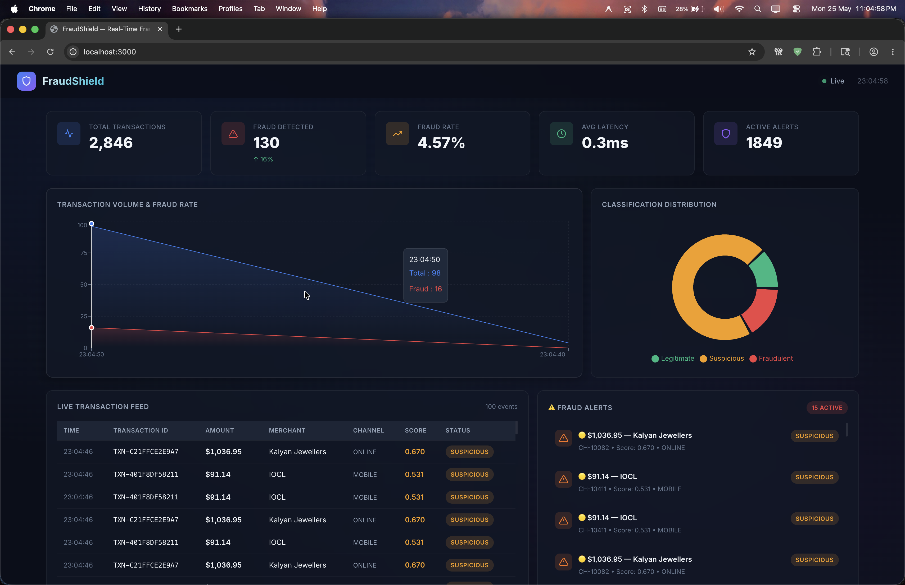

# Real-Time Fraud Detection System

A production-style, end-to-end Big Data system for real-time financial fraud detection using Apache Kafka, Apache Spark Structured Streaming, and Machine Learning. 

This project implements the architecture described in the IEEE paper: *"Real-Time Fraud Detection using Apache Kafka and Spark Streaming: A Distributed Stream Processing Approach."*

 *(Note: Replace with actual screenshot when running)*

---

## 🏗️ Architecture

The system consists of 5 decoupled layers:

1. **Ingestion**: A Python transaction generator simulates POS/Online transactions and publishes them to Kafka.
2. **Messaging**: Apache Kafka acts as the high-throughput, fault-tolerant message broker.
3. **Processing**: Spark Structured Streaming consumes events, applies real-time feature engineering (e.g., rolling window aggregates), and runs ML inference.
4. **Storage**: PostgreSQL stores transaction history, fraud alerts, and model metadata.
5. **Dashboard**: A React + Vite frontend provides a live dashboard connected to a FastAPI backend via WebSockets.

---

## 🛠️ Technology Stack

- **Big Data**: Apache Kafka, Apache Spark Structured Streaming, PySpark
- **Machine Learning**: Scikit-Learn (Random Forest, Logistic Regression, Isolation Forest)
- **Backend**: FastAPI (Python), SQLAlchemy, WebSockets
- **Frontend**: React 18, Vite, Recharts, Tailwind-inspired custom CSS
- **Database**: PostgreSQL 15
- **DevOps/Monitoring**: Docker, Docker Compose, Prometheus, Grafana

---

## 🚀 Quick Start (Docker)

The easiest way to run the full stack is using Docker Compose. Ensure you have Docker Desktop installed.

### 1. Start the Infrastructure
This spins up Zookeeper, Kafka, PostgreSQL, Backend, Frontend, and Monitoring tools.
```bash
docker-compose up -d
```

### 2. Access the Applications
- **React Dashboard**: http://localhost:3000
- **FastAPI Swagger Docs**: http://localhost:8000/docs
- **Kafka UI**: http://localhost:8080
- **Grafana**: http://localhost:3001 (User: admin / Pass: admin)

### 3. Generate Live Transactions
Open a new terminal and start the transaction generator to simulate live traffic:
```bash
# Generate 5 transactions per second with a 3.5% fraud rate
docker exec -it backend python /app/kafka-producer/producer.py --tps 5 --fraud-rate 0.035
```

Watch the React dashboard update in real-time as transactions flow through the system!

---

## 🧠 Machine Learning Module

The system uses a Random Forest model trained on the [Kaggle Credit Card Fraud Dataset](https://www.kaggle.com/datasets/mlg-ulb/creditcardfraud).

### Training your own model

1. Download `creditcard.csv` from Kaggle and place it in `ml/data/`.
2. Install dependencies:
```bash
cd ml
pip install -r ../backend/requirements.txt scikit-learn pandas imbalanced-learn matplotlib
```
3. Run the training script (handles SMOTE resampling and evaluates 3 different models):
```bash
python train_model.py --data data/creditcard.csv --output models/
```
4. Evaluate and generate plots (Confusion Matrix, ROC Curve, Feature Importance):
```bash
python evaluate_model.py --model models/fraud_model.joblib --data data/creditcard.csv
```

---

## ⚙️ Running Locally (Without Docker)

If you prefer to run the components directly on your host machine:

### 1. Start PostgreSQL
Ensure PostgreSQL is running locally and create a database named `fraud_detection`. Update `.env` accordingly.

### 2. Start the Backend
```bash
cd backend
pip install -r requirements.txt
uvicorn main:app --reload --port 8000
```

### 3. Start the Frontend
```bash
cd frontend
npm install
npm run dev
```

### 4. Run the Spark Streaming Job
If you don't have a local Kafka cluster, you can run the Spark job in **Simulation Mode**, which bypasses Kafka and generates synthetic transactions directly into the backend for demo purposes.
```bash
cd spark-streaming
pip install -r requirements.txt
python streaming_job.py --simulate --tps 5
```

---

## 📂 Project Structure

- `/ml/`: Machine learning training, evaluation, and feature engineering scripts.
- `/kafka-producer/`: Simulates legitimate and fraudulent banking transactions.
- `/spark-streaming/`: PySpark Structured Streaming job for live inference.
- `/backend/`: FastAPI application, database ORM, REST endpoints, and WebSocket server.
- `/frontend/`: React dashboard with real-time charts and live transaction feed.
- `/database/`: PostgreSQL initialization scripts.
- `/monitoring/`: Prometheus and Grafana configurations.

---

## 📜 License

This project is open-source and available under the MIT License. Suitable for academic submissions, B.Tech major projects, and portfolio demonstrations.
